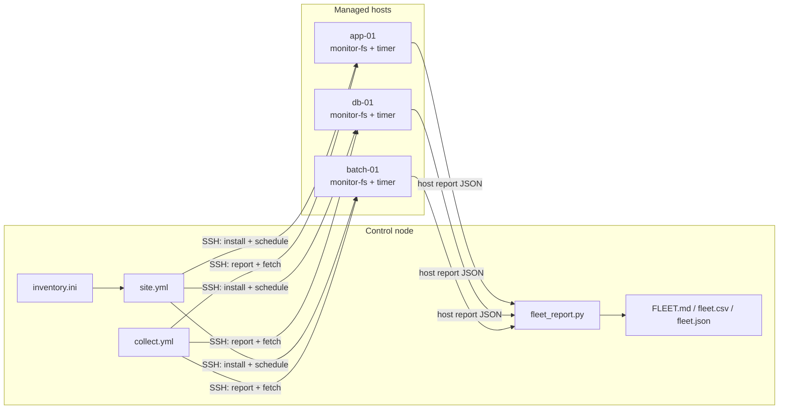

# system_disk

**Find the disks nobody is using — on one server or ten thousand — and put a monthly price tag on each one.**

[](https://github.com/NPKpadala/system_disk/actions/workflows/main.yml)


Every infrastructure estate quietly pays for storage nobody touches: the volume attached for a
2019 migration, the log mount sized for a traffic peak that never came back, the NFS export whose
last reader retired. Nobody deletes them, because nobody can prove they are unused.

`system_disk` collects the evidence. It watches real I/O and open file handles over a 30-day
window, then reports which filesystems are genuinely idle, which are oversized, and **what each
one costs per month** — so a decommission proposal arrives with a number attached instead of a
hunch.

---

## What it gives you

| | |
| --- | --- |
| **Evidence, not guesses** | Daily I/O deltas from `/proc/diskstats`, open-handle checks across `/proc`, and usage growth — a filesystem is only called idle when all three agree, for the whole window. |
| **Money, not gigabytes** | Every finding is priced with your own per-GB-month rate, rolled up to a monthly and annual figure per host and for the fleet. |
| **One server or the whole estate** | The same script runs standalone. Ansible ships it to N hosts and pulls N reports back into one roll-up — agentless, so nothing new runs as a daemon. |
| **Safe on production** | Nice 10, idle I/O class, a 5% CPU ceiling and a 128 MB memory cap enforced by systemd. Measured runtime is milliseconds, once a day. |
| **Safe by default** | `/`, `/boot`, `/usr`, `/var` and every virtual filesystem are excluded and cannot be flagged. Nothing is ever deleted, resized or unmounted — the tool only reports. |

---

## See it in 30 seconds

No servers required — this generates a synthetic 4-host fleet and reports on it:

```bash
make demo
```

```text
Host                 Mount                    Status              Used%  Size(GB)  Reclaim(GB) Action     Save/mo
-----------------------------------------------------------------------------------------------------------------
app-01.example.com   /mnt/backup-2019         Inactive             44.0   1,000.0      1,000.0 reclaim      80.00
app-02.example.com   /mnt/backup-2019         Inactive             44.0   1,000.0      1,000.0 reclaim      80.00
app-01.example.com   /mnt/legacy-nfs          Inactive              9.0     250.0        250.0 reclaim      20.00
app-01.example.com   /srv/logs                Active               33.0     300.0        171.3 shrink       13.70
app-01.example.com   /opt/app                 Active               18.0     100.0         76.6 shrink        6.12
app-01.example.com   /var/lib/mysql           Active               73.6     200.0          0.0 keep          0.00
-----------------------------------------------------------------------------------------------------------------
24 filesystems on 4 host(s) | provisioned 9,400.0 GB, used 4,174.6 GB
Idle: 8 | Oversized: 8 | Reclaimable: 5,991.4 GB
Current spend 752.00 USD/mo -> potential saving 479.31 USD/mo (5,751.72 USD/yr)
```

That last line is the point of the whole repository.

---

## One server

Nothing to install: a single file, standard library only.

```bash
sudo ./monitor_fs.py collect                 # run daily (systemd timer or cron)
sudo ./monitor_fs.py report --days 30        # read the verdict
```

Useful variations:

```bash
# Price it with your real storage rate and export for a spreadsheet or a ticket
./monitor_fs.py report --cost-per-gb-month 0.115 --currency EUR --csv findings.csv

# Watch only the volumes you care about
./monitor_fs.py --include-mount /data --include-mount /mnt/archive collect

# Fail a pipeline when reclaimable capacity appears (exit code 2)
./monitor_fs.py report --fail-on-findings
```

The first run only writes a baseline; the I/O deltas that make the report meaningful start on the
second one. Nothing is judged before `--min-days` (default 7) of evidence exists.

---

## The whole fleet

Ansible is agentless: one control node drives the estate over SSH, and the targets get a script
and a timer — no daemon, no agent to patch, no per-host licence. Onboarding host 500 costs exactly
what host 1 cost.

```bash
cd ansible
cp inventory.example.ini inventory.ini      # point it at your estate

ansible-playbook site.yml                   # deploy + schedule everywhere
ansible-playbook site.yml --check --diff    # or dry-run it first
ansible-playbook collect.yml                # pull every report into one roll-up
```



`collect.yml` writes three artifacts to `ansible/reports/`:

| File | For |
| --- | --- |
| `FLEET.md` | The human deliverable — totals, savings by host, and a ranked action list. Paste it into a ticket or a review. |
| `fleet.csv` | Finance and capacity planning. |
| `fleet.json` | Downstream automation, dashboards, or a CMDB feed. |

Handy flags:

```bash
ansible-playbook site.yml -l db -e batch=25%          # roll out in waves, one group
ansible-playbook collect.yml -e run_collect=true      # sample now instead of using history
ansible-playbook uninstall.yml                        # clean removal (history kept)
```

An unreachable host is skipped, not fatal: 499 reports still arrive.

---

## How a filesystem is judged

Three independent signals, collected daily:

1. **I/O** — sector deltas from `/proc/diskstats` since the last run. Under the threshold
   (default 1 MiB/day) counts as no I/O.
2. **Open handles** — one pass over `/proc/*/fd`, `cwd`, `root` and `exe` looking for anything
   rooted in the mount point.
3. **Growth** — the spread between the smallest and largest usage reading in the window.

| Verdict | Meaning | Action | Money |
| --- | --- | --- | --- |
| `Inactive` | No I/O, no open handles, no growth, for the entire window | `reclaim` | Full provisioned cost of the volume |
| `Active` + under 40% full | In use, but far larger than it needs to be | `shrink` | Cost of the capacity above usage + 30% headroom |
| `Active` | In use and appropriately sized | `keep` | — |
| `Insufficient data` | Fewer than `--min-days` readings, or counters unreadable | `wait` | Never priced |

**The safety rules that keep it honest:**

- A filesystem with **any** open handle is active, however quiet its I/O.
- Disk counters reset on reboot. A negative delta is recorded as *unknown*, never as *idle* — a
  rebooted host cannot fake an idle volume.
- A window that is entirely unknown never produces a verdict.
- Savings below `--min-saving-gb` are ignored, so nobody gets a ticket to reclaim 400 MB.
- System-critical mounts are excluded before any measurement happens.
- The tool reports. It never deletes, resizes or unmounts anything.

---

## The cost model

```
reclaim :  monthly_saving = provisioned_GB                    x rate
shrink  :  monthly_saving = (provisioned_GB - used_GB x 1.30) x rate
```

The rate is yours to set — `--cost-per-gb-month` on the CLI, `fs_monitor_cost_per_gb_month` in
`ansible/group_vars/all.yml`. Use your cloud list price, your negotiated rate, or your internal
chargeback number; the default of 0.08 USD is a placeholder, not a claim. Provisioned capacity is
what gets priced, because provisioned capacity is what gets billed — a 1 TB volume holding 40 GB
costs a full terabyte every month.

---

## Staying invisible on production hosts

Storage tooling that destabilises a host is worse than no tooling, so the overhead is bounded
from several directions at once:

| Control | Why it matters |
| --- | --- |
| `Nice=10`, `IOSchedulingClass=idle`, `CPUSchedulingPolicy=batch` | The collector yields to the workload for both CPU and disk. Also applied by the script itself via `os.nice()` and `ioprio_set`, so it holds under cron too. |
| `CPUQuota=5%`, `MemoryMax=128M` | Kernel-enforced ceilings — not a promise the script has to keep. |
| One pass over `/proc` for all mounts | The original per-mount `lsof` fork was O(mounts x processes). It is now a single walk that exits as soon as every mount is accounted for, with no subprocesses at all. |
| `RandomizedDelaySec=1800` | A 500-host fleet does not stampede at 02:17:00. |
| `TimeoutStartSec=300` | A run that somehow hangs is killed, not left behind. |
| `--retention-days 400` | The monitor's own data stays bounded: roughly 470 bytes per filesystem per day, about 2 MB/year on a 12-volume host. |
| `Persistent=true` | A host that was down catches up instead of losing a day of evidence. |

Measured on the container that built this repo: **0.014 s** for a full collection pass. Once a
day, at idle priority.

---

## Repository layout

```
monitor_fs.py                    Collector + single-host reporting (stdlib only)
fleet_report.py                  Merges host reports into a fleet roll-up (MD / CSV / JSON)
tools/demo_data.py               Synthetic fleet generator, so the reports can be demoed offline
tests/test_monitor_fs.py         26 unit tests covering parsing, verdicts, pricing and the roll-up
Makefile                         make demo | test | lint | deploy | fleet
ansible/
  site.yml                       Deploy and schedule across the fleet
  collect.yml                    Gather host reports, build the roll-up
  uninstall.yml                  Clean removal
  inventory.example.ini          Inventory patterns, including per-host overrides
  group_vars/all.yml             Cost model and reporting window
  roles/fs_monitor/              Install, schedule, report and uninstall tasks + systemd units
.github/workflows/main.yml       Tests on 4 Python versions, lint, and a real converge/uninstall
```

---

## Configuration worth knowing

| Setting | Default | What it changes |
| --- | --- | --- |
| `fs_monitor_cost_per_gb_month` | `0.08` | The price everything is denominated in |
| `fs_monitor_report_days` | `30` | Observation window |
| `fs_monitor_min_days` | `7` | Evidence required before any verdict |
| `fs_monitor_shrink_below_percent` | `40` | Fill level under which an active volume is a resize candidate |
| `fs_monitor_headroom_percent` | `30` | Headroom kept in a shrink proposal |
| `fs_monitor_activity_threshold_sectors` | `2048` | I/O per day that counts as "in use" (1 MiB) |
| `fs_monitor_exclude_mounts` | `[]` | Added to the built-in safe list — for volumes that must never be flagged |
| `fs_monitor_schedule` | `*-*-* 02:17:00` | When collection runs |
| `fs_monitor_manage_schedule` | `true` | Set false where an external scheduler owns cron-like work |

Everything is overridable per host or per group straight from the inventory:

```ini
[db]
db-01.example.com fs_monitor_cost_per_gb_month=0.12

[batch]
batch-01.example.com fs_monitor_exclude_mounts='["/mnt/regulatory-archive"]'
```

---

## Quality gates

```bash
make test     # 26 unit tests, no network, no fixtures to maintain
make lint     # ruff + ansible-lint (clean at ansible-lint's production profile)
make syntax   # playbook syntax check
```

CI runs on every push: the test suite across Python 3.9 / 3.11 / 3.12 / 3.13, both linters, and a
real converge — deploy to a live host, verify idempotence, build a fleet report, uninstall
cleanly. The tests pin the behaviour that matters: a rebooted host is never reported as idle, an
open handle always beats quiet I/O, a short history is never judged, and the roll-up never
double-counts its own output.

---

## Built with Claude Code

This repository was developed with [Claude Code](https://claude.com/claude-code), Anthropic's
agentic CLI, used as a pair programmer: designing the fleet architecture, writing the Ansible role
and the test suite, and reviewing its own output. Two defects were caught that way and are now
covered by tests — the fleet roll-up re-ingesting its own `fleet.json` on a second run, and reboot
counter resets that would have made a busy host look idle.

Every design decision here — what to measure, what to price, what to refuse to flag — was a human
call. The AI made the loop between decision and working, tested code a lot shorter.

---

## License

MIT — see [LICENSE](LICENSE).

Part of my portfolio — more at [npkpadala.com](https://npkpadala.com).
